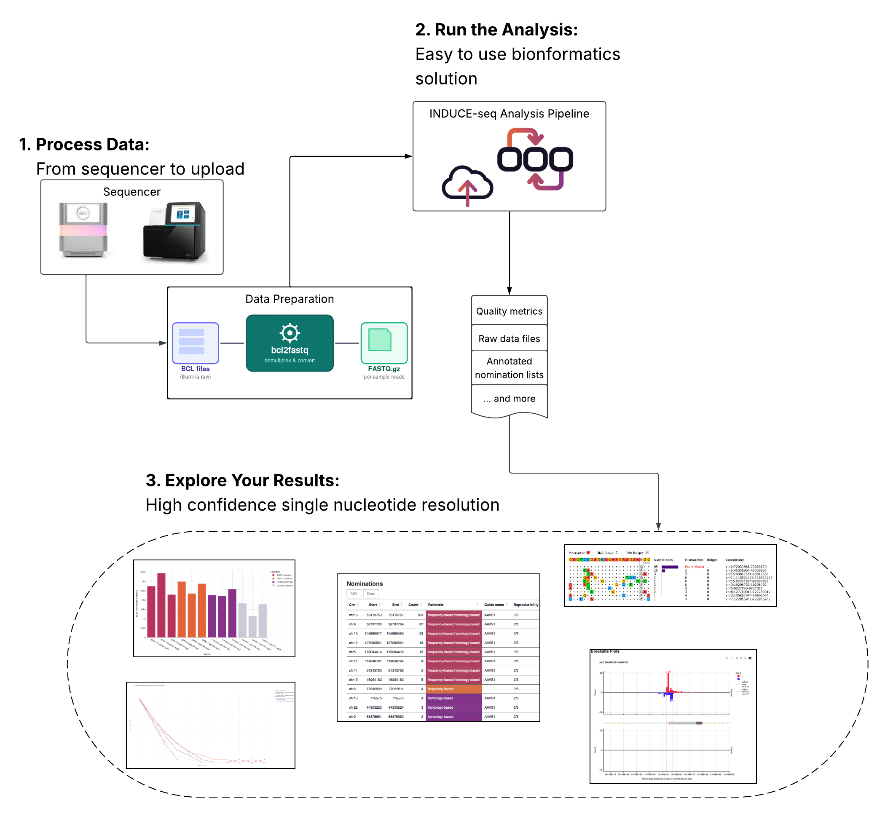

# INDUCE-seq® Analysis: From Sequencer to Results 

This guide takes you from your completed sequencing run to visualized results in three steps.
Follow them in order.

---

{ .workflow-img }

---

## What you'll need before starting

- Raw sequencing output (BCL files) from your INDUCE-seq run
- Your assay QC data (Qubit, qPCR) and sequencer QC metrics (Q30, %PF)
- Your nuclease guide and PAM sequences
- Access to the BSB INDUCE-seq Analysis Workspace on LatchBio

Not sure if you have everything? Start with [Step 1 — Before You Begin](before-you-begin.md).

---

## The Workflow

| Step | What you do | Time estimate |
|------|-------------|---------------|
| [Before You Begin](before-you-begin.md) | Gather inputs and confirm QC | 15–30 min |
| [Process Your Data](process-data.md) | Convert BCL → FASTQ and upload to LatchBio | 30–60 min |
| [Run the Analysis](run-analysis.md) | Build manifests, connect FASTQs, launch | 30–45 min |
| [Explore Your Results](explore-results.md) | Read the report, review nominations, open in IGV | 30–60 min |

---

!!! note "Full INDUCE-seq Analysis User Guide"
    This quick start is a high-level companion to the [INDUCE-seq Analysis User Guide](https://www.brokenstringbio.com/resource-library),
    which contains detailed instructions for every step. Section references are included
    throughout this guide where relevant.
